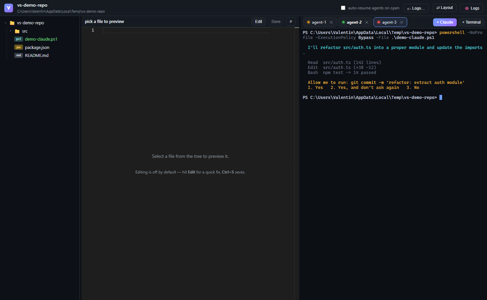

<p align="center"></p>

# VibeSpace

**One taskbar app per repository. File tree, code preview, and named Claude Code
agent terminals — in a single window that belongs to your repo.**

VibeSpace gives every git repository its own Windows app identity (its own
taskbar icon, its own pin, its own logo), and inside that window you run, watch,
and supervise any number of Claude Code agents. Close the window, reopen it next
week: every conversation comes back exactly where it left off.



*Three agents on one repo: amber = working, green = finished, red pulse = waiting
for your answer. Left: git-colored file tree. Top: Monaco preview.*

## Why

Running multiple Claude Code agents across repos from a pile of terminal windows
sucks: you lose track of which agent is waiting on you, windows die with your
shell, and there's no sense of "the place where I work on *this* project."
VibeSpace is that place — built for people who live in agents all day.

- **Per-repo identity** — each workspace pins to the taskbar as its own app with
  its own logo (Windows AppUserModelID, the Chrome-profile trick).
- **Agents never die** — a renderer reload or crash *re-attaches* to the running
  claude processes (same PIDs, scrollback restored) instead of killing them.
  Restarting VibeSpace, updating Claude Code, or rebooting resumes every
  conversation automatically via `claude --resume` with session tracking.
- **Supervision, not staring** — every agent tab has a status light
  (working / needs you / done) fed by injected Claude Code hooks, plus native
  toasts, a taskbar badge, unread markers, and a jump-to-attention hotkey.
- **Deliberately small** — no bundler, no accounts, no cloud. Electron +
  xterm + node-pty + Monaco, ~3k lines you can read in an afternoon.

## Features

| | |
|---|---|
| 🔵 **Agent status lights** | amber = working, red pulse = waiting for you, green = finished — driven by Claude Code hooks (`--settings` injection, merges with your own) |
| 🔔 **Attention toasts** | agent needs your answer or a turn failed → Windows notification (you pick which kinds in Preferences; "finished" is off by default); click focuses window *and* the exact tab |
| 📱 **Phone control + Away** | every agent shows up in the Claude phone app (Claude Code Remote Control, named "workspace · tab", follows tab renames): read, answer questions, approve, send follow-ups. The 📱 At PC / Away button decides when your phone buzzes: away = screen locked, 10 min idle or set by hand. Opt out per workspace in Preferences |
| ⌨️ **Ctrl+Shift+U** | jump to the next tab that needs you |
| ▦ **Agent board** (Ctrl+Shift+B) | every agent as a card: Needs you / Working / Done, with context, cost, tasks and a quick-reply box; other open workspaces listed below |
| 🌲 **Git-colored tree** | modified / added / untracked / deleted files and folders, refreshed live |
| 🌿 **Git sidebar** | Files \| Git tabs on the left, like VS Code. **Changes**: side-by-side diff of uncommitted work. **History**: searchable commit list with unpushed ↑, `agent` badges and "new since you looked" dots; click a commit for its files; diffs open in the preview. Top-bar branch chip shows ahead/behind. Right-click a tree file → Git history. Read-only on purpose: agents do the git work |
| 🔍 **Ctrl+P** | fuzzy file finder over the whole repo |
| 🔍 **Ctrl+F** | search inside the active terminal (Monaco keeps its own find) |
| 💬 **Session tracking** | terminals ↔ conversations are paired automatically; dead sessions reopen Claude's interactive resume picker |
| ↻ **Smart restart button** | appears only when VibeSpace's own code changed or Claude Code auto-updated (the label says which); restarts at once when no agent is busy (a manual "Restart this workspace" is always in ⚙ Preferences) — restart on your schedule, never mid-agent-run |
| 🏷 **Logos** | click the logo to give the workspace its own icon; pins refresh automatically |
| 📋 **Windows integration** | Explorer right-click → "Open with VibeSpace"; tree right-click → Open / Reveal in File Explorer; per-workspace taskbar pins, taskbar badges |

## Install

**Windows 10/11.** Grab `VibeSpace Setup <version>.exe` from
[Releases](../../releases), install, pin the launcher. Claude Code must be on
PATH (`~/.local/bin/claude` is picked up automatically).

### From source

```powershell
git clone https://github.com/enerage/vibespace.git
cd vibespace
npm install
npm run rebuild   # builds node-pty for Electron
npm start         # launcher; or: npm run dev (adds opt-in hot reload)
```

## How it works (short version)

- Each workspace is **its own Electron process** with a unique AppUserModelID
  set before app-ready — that's what makes Windows treat it as a separate app.
- Agent terminals are **xterm.js over node-pty (ConPTY)**. The claude processes
  live in the main process, so a reloaded renderer *re-attaches* to them
  (256 KB output ring per terminal restores scrollback).
- Claude is launched with an injected `--settings` file whose hooks append
  `working / waiting / done` to a per-terminal file the app watches.
- Conversations in `~/.claude/projects/` are paired to tabs by launch-time
  heuristics + pinned resume ids — see `CLAUDE.md` for the full mechanics and
  every hard-won lesson (protocol caching, splitter physics, ConPTY quirks).

## Developing

```powershell
npm run smoke    # 20 self-tests — run after touching main-process code
npm run dist     # NSIS installer (electron-builder)
```

Regenerate the README screenshot (staged demo repo → captured window):

```powershell
electron . --open-repo=<demo-repo>          # once, to create the workspace
electron . --workspace=<its-id> --screenshot=assets/screenshot.png
```

Read `CLAUDE.md` first — it encodes the decisions learned the hard way.
`RESEARCH-HOTRELOAD.md` and `RESEARCH-USER-PAIN.md` document the two big
investigations (why reloads used to kill agents, and what agent users
actually complain about). `TODO.md` is the honest roadmap.

## License

[MIT](LICENSE)
